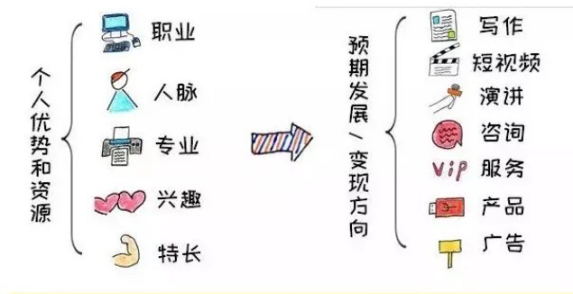

# 副业行动指南
### 高效完成本质工作后找空余时间
##### 本身工作忙,工作内容繁多
- 审视目前繁多的工作
- 将对职场发展影响不大的工作内容交给别人做
##### 工作强度不大,但是时间长
- 可以将自己的副业的准备和学习内容,在上班的休息时间完成
##### 拖延
- 将事情分成小的不可思议的一小步,仅靠少量的意志力就能完成
- 将这个行动形成惯性,每天坚持下去
### 如何正确选择副业

- 拿出一张白纸,写上职业,专业,兴趣,特长,人脉等关键词
- 每个关键词下写出所有的技能和资源
- 这样整理出个人资源图
